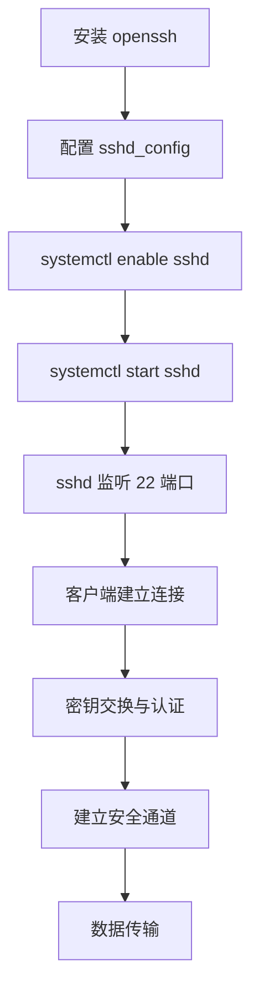

> 连接不是数据流动，而是信任建立。

---

## 📦 一、安装与基础概念

### 1.1 安装 SSH 服务
```bash
# 核心安装命令
sudo pacman -S openssh
```

**安装实际发生的逻辑：**
- 解析依赖树（`glibc`, `openssl` 等）
- 从 Pacman 仓库下载签名包
- 验证数字签名和文件完整性
- 解压到 `/usr` 和 `/etc` 目录
- 更新 pacman 数据库

### 1.2 核心概念理解
- **SSH 不是"软件"，而是系统与外部世界对话的协议契约**
- **守护进程**：`sshd` 监听 22 端口，建立加密连接通道
- **系统服务**：通过 systemd 统一调度和管理

---

## ⚙️ 二、配置文件结构

### 2.1 主要配置文件
| 文件路径 | 作用 | 特点 |
|---------|------|------|
| `/etc/ssh/sshd_config` | 主配置文件 | 声明式配置，启动时解析 |
| `/etc/ssh/ssh_config` | 客户端配置 | SSH 客户端行为控制 |
| `~/.ssh/authorized_keys` | 用户密钥 | 用户级别的访问控制 |
| `/etc/ssh/ssh_host_*` | 系统密钥 | 主机身份标识 |

### 2.2 配置文件特性
- **声明式**：sshd 启动时解析整个配置文件，建立运行时策略
- **KISS 原则**：最小权限、透明配置、安全默认

---

## 🔧 三、systemd 服务管理

### 3.1 基本管理命令
```bash
# 启动服务
sudo systemctl start sshd

# 启用开机自启
sudo systemctl enable sshd

# 查看服务状态
systemctl status sshd

# 停止服务
sudo systemctl stop sshd

# 重启服务
sudo systemctl restart sshd
```

### 3.2 服务管理层次
```
systemd 调度
    ↓
sshd 守护进程管理
    ↓
具体网络连接处理
```

**管理关系：**
- `systemd` 管理 `sshd` 进程生命周期
- `sshd` 管理具体网络连接生命周期
- `enable` 创建 systemd 目录符号链接
- `start` 立即启动进程

---

## 🔒 四、安全与配置逻辑

### 4.1 SSH 协议的本质
> **让两个陌生系统在不可信网络中建立可信关系**

### 4.2 信任建立过程
```
配置文件是契约  ←  →  系统服务是执行者  ←  →  客户端连接是验证
```

### 4.3 核心安全原则
- **最小权限**：只开放必要的功能
- **透明配置**：清楚每项配置的作用
- **安全默认**：默认配置即是最安全的

---

## 📖 五、运行逻辑总结

### 5.1 完整流程


### 5.2 关键特性
- **每次连接都是独立的 fork 子进程**
- **配置文件是声明式的**，非交互式
- **包管理系统负责依赖和完整性验证**
- **systemd 提供统一的进程生命周期管理**

---

## 🎯 六、实践要点

### 6.1 常用验证命令
```bash
# 检查服务是否运行
ps aux | grep sshd

# 检查端口监听状态
ss -tlnp | grep :22
# 或
netstat -tlnp | grep :22

# 查看系统日志
journalctl -u sshd
```

### 6.2 故障排查思路
1. **服务状态**：`systemctl status sshd`
2. **配置语法**：`sshd -t`
3. **网络连通**：`telnet hostname 22`
4. **日志分析**：`journalctl -u sshd -f`

---

## 💡 哲学思考

> **"系统不是被安装的，而是被配置的。"**
> 
> **"安装只是将可能性带入系统，真正的能力来自配置和服务管理。"**

SSH 服务在 Arch Linux 中体现了一种**简约而不简单**的设计哲学：通过简洁的工具链（pacman + systemd），实现复杂的网络服务能力。每个组件都有明确的职责，配置清晰可见，管理统一标准化。

---

*笔记整理时间：2025年11月8日*  
*参考：Arch Wiki — OpenSSH, systemd 官方文档*