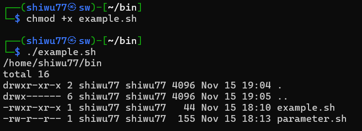

Shell终端解释器是人类与计算机硬件之间的“翻译官”,Shell脚本命令的工作方式有以下两种：

1. 交互式（Interactive）：用户输入一条命令，系统立即执行。
2. 批处理（Batch）：用户事先编写一个完整的Shell脚本，Shell会一次性执行脚本中的所有命令。

我们可以通过查看 `SHELL` 变量，得知当前系统的默认Shell。

# 一、编写简单的脚本

示例：**查看当前所在工作路径并列出当前目录下所有的文件及属性信息。** 


>[!注意]
>Shell脚本的名称可以随意取，但是推荐奖 `.sh` 后缀加上，以表示这是一个脚本文件。

1. 第一行 `#!/bin/bash` 是用来告诉系统使用哪种Shell解释器执行该脚本。
2. 第二行的 `#` 是对脚本功能和某些命令的介绍信息，是一个注释。
3. 第三、四行则是Liunx命令。

运行一下试试看：


这样可以直接运行Shell脚本。还有一种方法是通过输入脚本的完整路径来运行执行，但是 **默认情况下** 会提示权限不足。就像这样：


此时，只需要为脚本增加 **可执行权限** 即可：



# 二、接收用户的参数

Linux系统中的Shell脚本语言内设了用于接收参数的变量，变量之间使用空格间隔。

- **$0** ：对应当前Shell脚本的名称。
- **$#** ：对应的是总共有几个参数。
- **$\*** ：对应的是所有位置的参数值。
- **$?** ：对应的是显示上一次命令的执行返回值。
- **$1** 、**$2** 、**$3** ......：分别对应着第N个位置的参数值。

练习：


运行结果：


---


# 三、判断用户的参数

**Shell脚本** 中的条件测试语法可以判断表达式是否成立，若条件成立则返回数字0，否则返回非零值。条件测试语法的执行格式如下：

```Shell
测试语句格式： [ 条件表达式 ] # 注意，[]内两边各有一个空格。
```

按照测试对象来看，条件测试语句常被分为4种类型：条件测试语句、逻辑测试语句、整数值比较语句、字符串比较语句。

## 文件测试语句

文件测试语句是指使用指定条件来判断文件是否存在或权限是否满足等情况的语句结构，它使用的操作符以及作用如表所示：

| 操作符 | 作用              |
| --- | --------------- |
| -d  | 测试文件是否为目录类型     |
| -e  | 测试文件是否存在        |
| -f  | 判断是否为一般文件       |
| -r  | 测试当前用户是否具有可读权限  |
| -w  | 测试当前用户是否具有可写权限  |
| -x  | 测试当前用户是否具有可执行权限 |

使用 `-d` 测试 **/etc/fstab** 是否为一个目录类型的文件，然后通过 `echo $?` 显示上一条命令执行后的结果。
 
```Shell
┌──(shiwu77㉿sw)-[~/bin]
└─$ [ -d /etc/fstab ]

┌──(shiwu77㉿sw)-[~/bin]
└─$ echo $?
1
```

再使用 `-f` 来判断/etc/fstab是否为一般文件，如果返回值为0，则代表文件存在，且为一般文件。

```
┌──(shiwu77㉿sw)-[~/bin]
└─$ [ -f /etc/fstab ]

┌──(shiwu77㉿sw)-[~/bin]
└─$ echo $?
0
```

## 逻辑测试语句

逻辑测试语句用于对测试结果进行逻辑分析，根据测试结果可实现不同的效果。

### 逻辑”与“

在Shell终端中，逻辑”与“的运算符是 **&&** ，表示当该运算符前面的命令执行成功后才会执行运算符后面的命令。

```Shell
┌──(shiwu77㉿sw)-[~/bin]
└─$ [ -e /etc/fstab ] && echo "存在！！"
存在！！
```

### 逻辑“或”

逻辑”或“，它在Linux系统中的运算符为 `||`  ，表示当该运算符前面的命令执行失败后才会执行该运算符后面的命令。

```Shell
┌──(root㉿sw)-[~]
└─# [ $USER = root ] || echo "user"

┌──(root㉿sw)-[~]
└─# su - shiwu77
┌──(shiwu77㉿sw)-[~]
└─$ [ $USER = root ] || echo "user"
user
```

### 逻辑“非”

逻辑“非”，在Linux系统中用一个感叹号 `!` 来表示，它表示将条件测试中的判断结果取反值。也就是说，当原本的测试结果为正确的，则将其变为错误的；当原本测试结果为错误的，则将其变为正确的。

现在，切换为 **root** 用户，再判断当前用户是否为一个非管理员用户。

```Shell
┌──(root㉿sw)-[/home/shiwu77]
└─# [ ! $USER = root ] || echo "Administrator"
Administrator
```

1.  `[ ! $USER = root ]` ：对当前用户是否为root的测试结果取反值。
2.  `||` ：逻辑“非”。
3.  `echo "Administrator"` ：打印Administrator到终端。

因为当前是root用户，所有 `[ ! $USER = root ] || echo "Administrator"` 在两次否定后变成正确。

>[!注意]
> `!` 应该放在判断语句的前面，代表对整个逻辑测试语句进行取反值操作，而不应该将 `!` 放在 `=` 的前面。这样缺少了逻辑关系。

再来一个小练习：

```Shell
┌──(root㉿sw)-[/home/shiwu77]
└─# [ ! $USER = root ] && echo "user" || echo "root"
root
```

>[!注意]
>在这个逻辑运算中， `&&` 和 `||` 遵循短路求值规则，仅当前面的 `&&` 左侧条件为假时，才会执行后面的 `||` 运算符。

## 整数值比较语句

 **整数值比较语句是Shell脚本中用于判断两个整数值之间关系的语句，通过特定的比较运算符来实现数值大小、相等与否的判断，从而根据判断结果执行不同的操作逻辑。** 

需要理解的是，整数比较运算符==仅适用于对数字的操作==，不能将数字与字符串、文件等内容一起操作，而且 ==不能想当然地使用日常生活中的等号、大于号、小于号等来判断。== 


| 运算符 | 作用      |
| --- | ------- |
| -eq | 是否等于    |
| -ne | 是否不等于   |
| -gt | 是否大于    |
| -lt | 是否小于    |
| -le | 是否等于或小于 |
| -ge | 是否大于或等于 |
