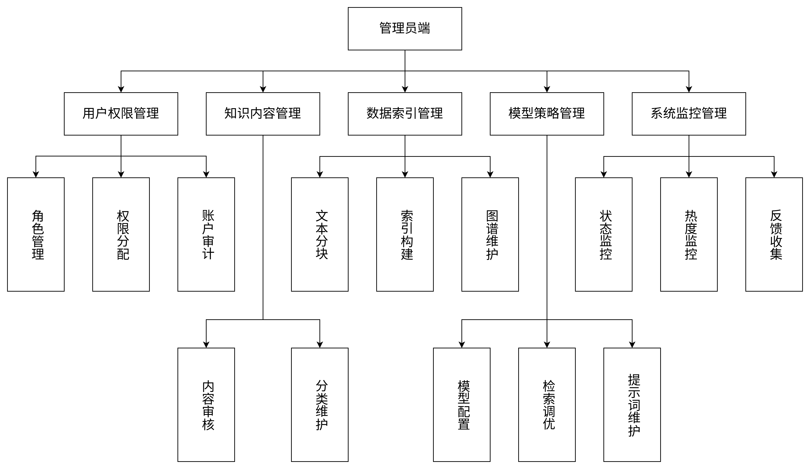

## 1.国内外有关的研究动态

（1）国内研究动态

早期知识库管理研究主要聚焦于知识的结构化存储与检索效率提升，但随着信息量激增与需求多样化，传统方法逐渐暴露出智能化不足的问题。早期研究者发现，大语言模型（LLMs）更新慢、容易出现幻觉，难以满足专业领域对高准确性的知识管理需求。因此，研究重点开始转向通过检索增强生成（RAG）引入外部知识，以弥补模型的知识缺陷，提升知识库系统的动态更新与智能问答能力。

近年来，国内研究逐渐将关注点转向数据安全与本地化部署。在知识库管理场景中，由于中小企业及个人用户预算有限、硬件条件受限，研究者普遍采用小参数中文模型（如 ChatGLM）来构建安全、低成本的本地问答与知识管理系统。研究方向主要包括混合检索与多智能体协同：前者结合语义检索与知识图谱以提升知识检索的准确性；后者通过多个小模型协作，实现对复杂知识管理任务的分工与优化。近年来，王祎（2025）将 RAG 与知识图谱用于红色档案知识库管理，实现了安全可控的本地部署；王志远等（2025）提出的 MSCG-RAG 方法则通过多智能体协同优化工业领域知识问答系统的部署效率。

不足方面，目前红色档案等特定领域的数据资源有限，知识库构建仍不完整，语义关联性弱。此外，小模型的推理与泛化能力仍显不足，在面对复杂知识结构或跨领域问题时存在性能瓶颈，限制了本地化知识库系统的智能化水平与应用广度。

（2）国外研究动态

早期知识库管理研究在国外主要以理论与架构探索为主，研究者重点关注如何利用大语言模型（LLMs）提升知识检索与内容生成的效率。早期的 RAG 系统多采用简单的检索与生成机制，其核心目标是提高知识库中信息调用的准确性与生成内容的相关性。这一阶段的研究为智能化知识库管理奠定了理论与技术基础。

近年来，国外研究逐渐从基础架构优化转向构建更加智能、自主的知识库管理体系。典型方向包括 Agentic RAG 框架与自我优化机制，强调系统在检索、生成与验证环节的自我检查与动态修正能力。例如，Self-RAG 模型通过引入“反思”机制实现知识检索与内容生成的自我评估；PR-RAG 框架在知识库任务规划中融合反思模块以优化信息调用流程；MMOA-RAG 则利用多智能体强化学习提升知识库系统的自适应与协同能力。这些研究推动了知识库管理从静态存储向动态学习与持续优化的方向发展。

不足方面，尽管国外研究在知识库自我优化与智能检索上取得显著进展，但智能体间协同仍有待完善，系统在复杂知识结构下的自组织与验证机制尚不成熟。同时，模型幻觉与大规模知识检索效率问题依然存在，影响了知识库系统的可靠性与可扩展性。这些问题表明，智能化知识库管理仍需在精确性与效率之间寻求更优平衡。

## 2.理论与实际意义

（1）理论意义

本研究在个人知识管理领域提出了一套新的智能化框架。该框架将前沿的检索增强生成技术（RAG）与具备自主决策和自我学习能力的智能体架构相结合。

首先，本研究丰富了在本地大模型环境下实现知识库智能化管理的理论。针对个人知识类型多样且复杂的特点，研究致力于解决异构知识的深度融合问题，即如何高效地结合非结构化文本（如笔记）和结构化知识（如知识图谱）进行检索和推理。

其次，本研究深化了知识增强系统在闭环优化和持续学习方面的探索。通过引入源自先进智能体架构的自我修正机制，系统能够像拥有“错题本”一样，评估回答的准确性，从历史错误中学习，并自动优化查询和推理策略。这为构建具备自我演进能力的知识代理系统提供了理论基础和实践路径。

（2）实际意义

本研究的实际意义在于通过技术创新，为个人用户提供了一个兼顾数据隐私、检索效率和智能交互的实用化解决方案。

最关键的价值在于保障用户数据安全。本系统采用本地大模型进行私有化部署，确保用户的私人笔记和敏感信息安全地存储在本地计算环境中。这从根本上解决了传统基于云服务的知识管理方案中存在的隐私和数据主权风险。

此外，本系统显著提高了知识利用和学习效率。通过深度语义检索技术，用户可以摆脱传统的关键词匹配，高效、准确地从海量笔记中提取和利用知识。大模型生成的回答具备可信度和可追溯性，能够引用知识来源，有效避免了模型幻觉问题。最终，本研究将传统的知识存储系统升级为一个集知识问答、分析和深度消化功能于一体的智能工作台，帮助用户更好地学习和利用个人知识资产。

## 设计的主要内容及可能的创新点

本篇设计主要内容如下：

第一部分绪论，主要写了设计的选题背景、研究意义，并介绍了相关概念与技术，为设计的完成奠定基石。

第二部分系统规划，主要写了系统初步调查、系统的目标，并进行可行性分析。

第三部分系统分析，主要写了系统角色分析，系统需求分析，对系统功能性与非功能性需求进行描述，建立系统用例模型，以及对系统静态（设定类并建立类图）、动态分析（活动图和顺序图）。

第四部分系统设计，主要写了系统模块结构设计、系统功能模块介绍、代码设计、数据库设计、输入输出设计、概念结构设计、逻辑结构设计、物理结构设计。

第五部分系统实施，主要写了系统登录界面设计，系统主界面设计，至此系统完成。

第六部分总结与展望。

第七部分参考文献。

## 模块图

