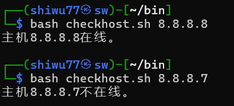

# 条件测试语句 if

`if` 条件测试语句使得脚本能够根据实际情况自动执行相应的命令。从技术角度来说，可以分为单分支结构、双分支结构、多分支结构。

## 单分支结构

单分支的 `if` 语句由 `if` 、 `then` 、 `fi` 关键词组成，只有在条件成立时才执行预设的命令，相当于口语中的“如果……那么……”。

语法格式：

```Shell
if 条件测试操作
	then 命令序列
fi
```

下面使用单分支的 `if` 条件语句来判断 **/media/cdrom** 目录是否存在，若不存在就创建该目录，否则就结束条件判断和整个 Shell 脚本的执行。

```Shell
#!/bin/bash
DIR="/media/cdrom"
if [ -d $DIR ]
then
	mkdir -p $DIR
fi
```

在运行完这个脚本后，可以通过 `ls -ld /media/cdrom` 来验证这个文件夹是否被创建。


## 双分支结构

双分支的 `if` 语句由 `if`、`then` 、 `else` 、 `fi` 关键词组成，它进行一次条件判断，若条件匹配则执行相应命令，否则执行另一命令，相当于口语中的“如果……那么……否则……”。

语法格式：

```
if 条件测试操作
	then 命令序列1
	else 命令序列2
```

接下来使用双分支结构来验证某台主机是否在线，然后根据返回值的结果，要么显示主机在线信息，要么显示主机不在线信息。


这里直接使用  `bash checkhost.sh 域名` 的方式运行代码。其中 **ping命令** 用来测试与主机的连通性。 `-c` 参数规定尝试的次数， `-i` 参数定义每个数据包的发送间隔， `-w` 定义等待超时时间。



### 多分支结构

多分支的结构由 `if`、`then`、`else`、`elif`、`fi` 关键词组成，它进行多次条件判断，任何一项匹配成功即执行相应命令，相当于口语中的“如果……那么……如果……那么……”。

下面使用多分支的 `if` 条件语句来判断用户输入的分数在哪个成绩区间，然后输出优秀、及格、不及格等提示信息。在 Linux 系统中，`read` 是用来读取用户输入信息的命令，能够把接收到的用户输入信息赋值给后面的指定变量， `-p` 参数用于向用户显示一些提示信息。